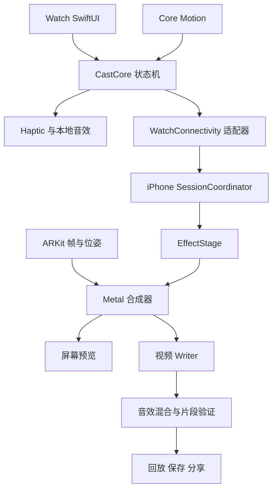

# Wrist Magic / 腕术 — DESIGN.md

版本：1.0 · 2026-10-08 · 状态：开发前设计基线，待用户审阅。

## 1. 目标与决策等级

腕术是 Apple Watch 驱动的现实世界超能力玩具。抬腕、转动 Crown、挥动，得到即时声音、触感和屏幕魔法反馈；iPhone 让效果进入镜头，并生成可以分享的短片。成功指标是容易开始、动作有回应、短片值得分享。

**用户已确认**：方向 1 / Obsidian Ritual；黑曜石、暖金、电影感法术；Apple Watch + iPhone；Fireball / Lightning / Force Push；Crown / Motion / Haptic；Reality Mode 与 Show Off Mode。

**本文件给出的工程决策**：最低部署 iOS 17 / watchOS 10；仅后置相机；竖屏；Show Off 首版固定 6 秒；固定构图、预设发射位置；ARKit + Metal 同一合成器负责预览与导出；无现场麦克风录音，只混入应用法术音效。这些是可审阅的首版方案，不冒充此前已确认要求。

**未验证**：用户当前 Watch 型号、系统版本、Mac/Xcode/签名状态；动作命中率；跨设备时延；持续帧率与功耗；人物与特效的视觉对齐。iPhone 13、Series 7 作为优先验证设备假设，执行 T01 记录真实设备。当前文档在 Linux 编写，未编译 Apple 工程、未完成真机测试。

## 2. 范围与交付边界

| 层级 | 包含 | 交付判据 |
|---|---|---|
| M0 验证 | Motion、WatchConnectivity、带效果录像三个探针 | 真机证据通过，失败明确阻断后续依赖 |
| M1 腕上玩具 | 三术、Crown、动作触发、预设触感、基础声音、教学、离线练习 | 无 iPhone 也能练习；20 次重复施法无重复触发 |
| M2 Reality | 连接、权限、AR 舞台、三种效果、暂停恢复 | 实时效果能稳定响应 Watch |
| M3 Show Off | 机位引导、倒计时、6 秒录像、回放、保存、系统分享 | 视频有特效、有应用音效、无控制 UI |
| M4 收口 | 无障碍、异常、性能、设备安装说明、视觉验收 | 测试矩阵完整，阻塞项归零 |

不含账号、云后端、社交 feed、付费墙、法术商店、排行榜、复杂剪辑、前置相机、手掌/手指追踪、人与虚拟物体的真实遮挡、多人联机、Complication、Double Tap 专属玩法、后台全天监听。没有上述能力也不得用虚假状态补齐。

Show Off 的“从手中发出”依靠固定机位和站位引导，特效发射点是镜头内预设位置。Watch 的惯性数据不能单独提供相机坐标下的手腕 6DoF。自由手部跟随需要独立研究，不在首版兑现。原型中的照片和巨大火焰是美术目标，不是技术验证证据。

## 3. 权威顺序与视觉源

冲突时：平台安全/可访问性与真实能力 > 本文明确的交互状态和 token > 定稿原型 > 实现者个人偏好。改动基线必须记 ADR，说明原因与截图，不得以“更现代”为由重画。

| 引用 | 文件 | 权威内容 |
|---|---|---|
| x1 | `design/references/x1-direction.png` | 黑金方向、法术质感、整体层级 |
| x4 | `design/references/x4-watch-flow.png` | 三术、蓄力、就绪、释放 |
| x5 | `design/references/x5-iphone-entry.png` | 连接、教学、练习、主页 |
| x8 | `design/references/x8-modes.png` | 正确的准备/倒计时/录制/回放顺序 |
| x9 | `design/references/x9-recovery.png` | 权限页无相机画面，异常恢复与设置 |

x6、x7 已被替代，禁止作为实现基线。图中的设备示意、英文页脚、展板标题不进入 App。不得把展板裁成整屏位图模拟交互。品牌插图拆为独立资源；正文、按钮、图标、弧线用原生控件/渲染实现。

## 4. 设计系统

### 4.1 色彩与字体

| Token | 值 | 用途 |
|---|---|---|
| background | #080808 | 应用底色；Watch 可用 #000000 |
| surface | #171717 | 列表、必要的操作容器 |
| elevated | #242424 | sheet 与次级控件 |
| textPrimary | #F7F2E8 | 标题正文 |
| textSecondary | #C2BAAC | 辅助说明 |
| accentGold | #E6C486 | 主按钮、选中、进度 |
| goldHighlight | #F4DEAE | 极克制的主按钮上沿高光 |
| onGold | #17120B | 金色按钮文字 |
| separator | #3D3932 | 非关键分隔线 |
| recording | #FF453A | 仅录制/停止提示 |
| disabledText | #817B71 | 禁用；同时有状态语义 |

蓝白只用于 Lightning 美术，橙色只用于 Fireball 美术，灰白用于 Force Push。控件不随法术换品牌色。首版只做深色主题，系统警告与分享面板保持系统行为。

UI 使用系统字体：iPhone 大标题 32/38 semibold，屏幕标题 24/30 semibold，正文 17/24 regular，按钮 17 semibold，辅助 14/20；Watch 标题 20/24 semibold，核心动作 24/28 bold，正文 16/20，辅助 13/17。所有字号通过 Dynamic Type 缩放。品牌“腕术”和首页 hero 可使用系统 serif design，中文回退系统字体；操作标签不得使用衬线。禁用模拟宋体细字按钮、全局字距拉宽、艺术字体正文。

iPhone 正文对比度目标 ≥4.5:1，大字/关键非文本元素 ≥3:1；在实际 camera + scrim 组合上测量，不用 token 对比代替现场测量。

### 4.2 几何与布局

- 间距阶梯 4 / 8 / 12 / 16 / 24 / 32 / 48 pt；不得为对齐随机引入 19、27 等数值。
- iPhone 页面左右 24 pt；紧凑宽度 16 pt；主按钮高 52 pt、胶囊圆角 26 pt，辅助按钮最小 44 pt；主次动作相距 12 pt。
- Watch 由 safe area 决定可用范围，内边距 8–12 pt；按钮高至少 44 pt。顶部采用原生导航，退出入口始终可达。
- iPhone 基准 390×844 pt，检查 375×667 与 430×932；Watch 基准 41mm/45mm 的模拟器真实逻辑尺寸，不能拿展板 PNG 像素当 pt。
- 手机主屏内容上到下：品牌与连接状态、标题、法术 hero、三术选择、模式选择、主动作。小屏先缩 hero，再允许内容滚动；按钮不能覆盖文字或系统安全区域。
- Watch 首屏：术名、hero、选择状态、CTA。不得在图上继续叠统计、完整三术列表和设置入口。
- 组件优先通过空白、文字、分隔线组织；单一 grouped list，不嵌套卡片。相机上的字必须有稳定 scrim，禁止直接贴在强光画面。

### 4.3 组件契约

| 组件 | 输入与状态 | 固定行为 |
|---|---|---|
| GoldButton | title, enabled, busy, action | busy 时进度+原文，防重复提交，不改变尺寸 |
| SecondaryButton | title, action | 透明/暗底描边，不与主按钮同等亮度 |
| ConnectionBadge | waiting / connected / disconnected | 文字+符号；connected 需要应用握手成立 |
| SpellHero | SpellID, phase, reducedMotion | 美术无文本；失败时静态合法占位符号 |
| SpellSelector | selected, isLocked | 三种文字标签，选中下划线/描边，不只靠颜色 |
| ModePicker | reality / showOff | 首页可切换；会话中锁定，退出后再切 |
| ChargeRing | progress 0...1 | clamp，百分比可读，100% 一次 ready 反馈 |
| CameraOverlay | tracking, connection, mode | 原生返回、简短指引；不进入导出帧 |
| CaptureControl | preparing / countdown / recording / processing | 各状态只有有效操作；不伪造录制计时 |
| ClipPlayer | clipURL, saveState, shareState | AVPlayer 回放，系统分享；保存失败不丢片 |
| RecoverySheet | cause, retryAction, exitAction | 聚焦根因；不可无限自动重试 |

### 4.4 动画、触感、声音

UI 切换 180ms easeOut；按钮按压 opacity/scale 至 0.98、120ms；禁持续呼吸式全屏亮度变化。法术主效果 1.2 秒、尾迹最多 0.3 秒。Watch 以可暂停的轻量粒子/序列帧为目标，不照搬手机高密度 shader。

| 事件 | Haptic 预设 | 声音策略 |
|---|---|---|
| 选术 | Crown 自带或 click 二选一 | 默认无声，禁止叠加 |
| 进入准备 | start 一次 | 轻提示，可关闭 |
| ready | directionUp 一次 | 轻提示 |
| 释放接受 | success 一次 | 当前端的短法术声 |
| 重试 | retry 一次 | 可无声 |
| 会话结束/暂停 | stop 一次 | 无声 |

应用主动触感调用至少间隔 250ms，不在每帧或每个蓄力百分比播放。所有预设语义需真机审听审感，不能承诺任意波形/力度。手机舞台在线时手机发声，Watch 只触感；离线练习由 Watch 发声，避免双端回声。声音关闭也使导出静音。Reduce Motion = 系统值 OR 应用值，减少粒子/闪光/镜头冲击，保留文字与状态；不偷偷关闭系统偏好。

## 5. 页面与状态清单

| ID | 页面/状态 | 入口 → 出口 | 关键约束 |
|---|---|---|---|
| W01–03 | 三术选择 | 启动/换术 → W04 | Crown 单一焦点；点准备才进入蓄力 |
| W04 | 蓄力 | 准备 → W05 | 归零开始，100% ready，切术清空 |
| W05 | 就绪 | 蓄满 → W06/W07 | 提示当前术的动作，有限窗口 |
| W06 | 释放 | 有效事件 → 再来/换术 | 单次事件单次释放 |
| W07 | 未触发 | 超时/低质量 → W04 | 不连续鸣叫；明确重试 |
| W08 | 暂停 | inactive/锁屏/断连 → 手动恢复 | 停止采样，清空蓄力与许可 |
| I01 | 连接 | 初次启动 → I02/I04 | 离线可查看教学；不自动弹蓝牙系统配对 |
| I02 | 教学 | Fireball 或其他术 → I03 | 抬腕停顿是姿势指导，不识别握拳 |
| I03 | 练习成功 | 一次本地通过 → I04 | 成功只证明一次动作，文案“这次成功了” |
| I04 | 首页 | 已完成教学/跳过 → I05/I06 | 三术、模式、连接、设置 |
| I05 | Reality 舞台 | 相机授权+握手 → W施法/退出 | 等 tracking normal，背景无权限时为空 |
| I06 | Show Off 准备 | 固定机位/选站位 → I07 | 显示站位轮廓和固定发射区，不承诺追踪手 |
| I07 | 倒计时 | 双端准备完成 → I08 | 3、2、1，无法术效果，不记录像时间 |
| I08 | 录制 | 第一有效帧 → I09 | 6 秒；一次施法；结束接受新术 |
| I09 | 处理中 | writer 完成+音轨混合 → I10 | 超时/失败可恢复，无成功假提示 |
| I10 | 回放分享 | 完成 → 重拍/保存/系统分享 | 分享取消留在回放，保存不读整个相册 |
| I11 | 相机拒绝 | denied/restricted → 设置/返回 | 黑底，不显示相机假画面 |
| I12 | 断连 | 会话失联 → 重新连接/结束 | 撤销旧会话事件，不补发旧施法 |
| I13 | 设置 | 首页 → 返回 | 声音、触感、减少动态、教学、连接帮助 |
| I14 | AR 不支持/跟踪受限 | capability/光线变化 → 重试/练习 | 禁称为 AR 正常，不后台持续录制 |
| I15 | 保存/导出失败 | 空间/Photos/编码错误 → 重试/分享/退出 | 保留可用源文件和错误原因 |

上述是 19 个展板状态之外补足的真实开发状态。原型细节修订：W01–03 选术用原生垂直分页/Picker，避免横向圆点误导 Crown；I03 成功文案改为“这次成功了”；录制过程中不切镜头；Watch 设置中不添加虚构 haptic 波形。

## 6. 交互与状态机

### 6.1 Watch 本地链路

`selecting → charging → ready → fired → selecting/charging`；任一阶段可 `paused`；ready 超时到 `retry`。

- 选术用 Crown 离散 0/1/2，点击“准备施法”锁定当前术。charge 用独立 binding 范围 0...1，完整一次蓄力需要约 1.5–3 秒的舒适旋转量，旋转灵敏度由 T02 真机记录，不能把物理圈数写成 SDK 保证。
- Motion 在 charging 期间采样但不触发，ready 后才识别。inactive 立即停止；恢复不自动沿用旧姿态/charge。
- 离线练习 ready 4 秒；联网 ready 由 iPhone 许可管理。结束后 700ms 防重复期，需重新蓄力。
- Fireball：前挥脉冲；Lightning：下挥脉冲；Force Push：向前推的平移脉冲。因当前术已选定，首版做“该术动作是否合格”的门控，不做同时分类三术的幻想通用识别器。
- 左右腕、表冠朝向由平台信息和校准转换；在两侧分别采样。基于重力、attitude 四元数、rotationRate、userAcceleration 与中立姿态；不把某个设备 x 轴硬编码成前方。
- VoiceOver 用户提供“轻点施法”的明确替代入口；常规动作玩法保留。此入口遵循相同许可与去重，不能绕过录像状态。

### 6.2 Reality Mode

打开舞台 → 相机授权 → AR 支持检查 → tracking normal → 握手 → 选术/蓄力 → 申请 arm 许可 → 就绪 → 接收 cast → 渲染与确认。位置不确定时使用当前相机坐标系前方 1.5m 的舞台锚，随后固定在世界坐标；画面轻触“重新定位”只在非施法状态可用。无真实碰撞与障碍物理解。

### 6.3 Show Off Mode

后置手机固定 → 人站入轮廓，选择发射区左/右（不是左右腕识别）→ Watch 选择术并蓄满 → 手机启动 3 秒倒计时 → 第一有效录像帧到达才进入 recording 并发 arm 许可 → Watch 触感就绪 → 在前 4.5 秒内施法一次 → 第 6 秒完成 → processing → review。

发射区初始 normalized 坐标左(0.35,0.45)、右(0.65,0.45)；引导人把施法手放在该区域。这些是固定构图的设计初值，不是手部检测结果。EffectStage 在录像开始以 camera transform 固定世界位置，渲染屏幕射线距相机 1.5m 的起点，向相机前方延伸 1.2m；Lightning 向舞台目标下落、Force Push 环沿前方扩展。投影按同一相机矩阵计算。拍摄中移动手机使 framing 无效时中止并提示重新放稳，不假装跟手。

倒计时可取消，不生成视频。6 秒从第一视频帧计，不从点击算。超过 4.5 秒新事件拒绝，保留至少 1.5 秒尾效；不成功施法仍回放，并提示“这次没触发，试试重拍”。手动停止 ≥2 秒可生成短片，<2 秒丢弃临时帧并回准备。录制中断/后台不交付假完整短片；有可解码 ≥2 秒内容时标注“录制已中断”，否则清理并重拍。

## 7. 架构与文件边界

原生 SwiftUI 双 Target + 本地 Swift Package。不开网页壳，不调用后端。共享纯模型与协议，传感器、摄像机、文件写入留在平台适配层。



```text
WristMagic.xcodeproj/                  # 原生工程与共享 schemes
Packages/WristMagicCore/
  Package.swift
  Sources/WristMagicCore/
    Domain/{Spell,CastState,CastReducer,MotionSample,GestureGate,GestureProfile,EffectCue}.swift
    Protocol/{WireEnvelope,SessionPermit,EventGate}.swift
    Capture/{ClipTimeline,EffectTimeline}.swift
  Tests/WristMagicCoreTests/
WristMagicWatch/
  App/WristMagicWatchApp.swift
  Casting/{WatchCastModel,SpellPickerView,ChargeView,ReadyView,ResultView}.swift
  Motion/{MotionSource,WristCalibration}.swift
  Feedback/{HapticPlayer,WatchSoundPlayer}.swift
  Connectivity/WatchLink.swift
WristMagiciOS/
  App/{WristMagicApp,AppModel}.swift
  Entry/{ConnectionView,TutorialView,HomeView}.swift
  Session/{PhoneLink,SessionCoordinator}.swift
  Stage/{ARFrameSource,StageRenderer,EffectStage,CameraTransform}.swift
  Stage/Shaders/{Camera,SpellEffects}.metal
  Capture/{CaptureCoordinator,ClipWriter,ClipAudioMixer,ClipValidator}.swift
  Clips/{ClipStore,ClipReviewView,PhotoSaver,SharePresenter}.swift
  Settings/{SettingsStore,SettingsView,PermissionCoordinator}.swift
SharedUI/{DesignTokens,GoldButton,SpellHero,ConnectionBadge}.swift
Resources/{Spells,Sounds,Localizable.xcstrings,ASSET-MANIFEST.md}
Tests/{iOS,Watch,UITests,Fixtures}/
scripts/{test-core,test-ios,test-watch,verify-clip,verify-assets}.sh
Evidence/{environment,motion,link,capture,visual,performance}/
```

文件名是新项目规划，未声称存在仓库或代码。Swift Package 不导入 WatchKit/ARKit/UIKit；单位使用秒、m/s²（适配层从 Core Motion g 转换）、rad/s，避免跨层单位混用。Swift 6 模式；actor 隔离 IO/transport 状态；UI MainActor。SDK 对对象的 Sendable 注解以实际版本编译结果为准，不用 unchecked Sendable 掩盖 race。

## 8. 共享接口与联网规则

```swift
public enum SpellID: String, Codable, Sendable { case fireball, lightning, forcePush }
public enum PlayMode: String, Codable, Sendable { case practice, reality, showOff }
public enum CastPhase: String, Codable, Sendable { case selecting, charging, ready, fired, retry, paused }
public struct CastState: Equatable, Sendable {
    public var spell: SpellID
    public var phase: CastPhase
    public var charge: Double
}
public enum CastAction: Sendable {
    case select(SpellID), prepare, crown(Double), armed, trigger, timeout, pause, resume, reset
}
public enum CastReducer {
    public static func reduce(_ state: CastState, _ action: CastAction) -> CastState
}
public struct MotionSample: Codable, Sendable {
    public let t: Double
    public let acceleration: SIMD3<Double> // m/s², without gravity
    public let rotationRate: SIMD3<Double> // rad/s
    public let gravity: SIMD3<Double>
    public let attitude: SIMD4<Double> // normalized quaternion x,y,z,w
}
public struct GestureDecision: Equatable, Sendable { public let accepted: Bool; public let reason: String }
public struct GestureProfile: Codable, Sendable { public let spell: SpellID; public let values: [String: Double] }
public protocol GestureGate: Sendable {
    func evaluate(samples: [MotionSample], profile: GestureProfile) -> GestureDecision
}
public struct SessionPermit: Codable, Sendable {
    public let sessionID: UUID
    public let token: UUID
    public let spell: SpellID
}
public enum WireKind: String, Codable, Sendable { case hello, select, armRequest, armGrant, cast, ack, pause, end, settings }
public struct WireEnvelope: Codable, Sendable {
    public let version: Int
    public let eventID: UUID
    public let sessionID: UUID
    public let sequence: UInt64
    public let kind: WireKind
    public let payload: Data
}
public struct CastPayload: Codable, Sendable { public let permit: SessionPermit; public let charge: Double }
public enum Receipt: String, Codable, Sendable { case accepted, duplicate, stale, invalid, unavailable }
public protocol LiveLink: Sendable {
    func send(_ envelope: WireEnvelope) async throws -> WireEnvelope
}
```

所有类型要提供显式 public initializer，避免 Package 外不可见的 memberwise init。每一种 payload 在 T05 定义独立 Codable struct；ack 包含 receipt 和原 eventID；hello 包含 appVersion、协议版本、requestedMode；select 包含 spell；armRequest 包含 spell/charge；armGrant 包含 SessionPermit 与本地有效时长提示；pause/end 含 reason；settings 含 revision 与三个 Bool。协议版本固定 1，JSON Data 用 sendMessageData，收到后先校验最大 16KiB、版本、合法 enum、有限数值与范围，再进状态机。不得对任意 Data 直接强制转换。

iPhone 是联网会话状态和录制时间的权威；Watch 是当前选术/蓄力的输入权威。iPhone 首页可推荐选术，但 Watch 确认 revision 后才生效；蓄力/就绪/录像锁定跨端选术。设置 iPhone 持有单调递增 revision，Watch 丢弃旧版；离线 Watch 只读取最后设置，不修改共享设置。

新舞台创建 sessionID，建立 hello 后 badge 才 connected。仅 WCSession activated + reachable 才发即时消息；reachable 不等于已准备相机或录像。静态设置可用 applicationContext，cast 不进入后台队列，不使用 transferUserInfo 补发。

每次 ready 申请单次 permit。Reality 许可由手机本地单调时钟计 5 秒，Watch 收到后本地最多 4 秒；Show Off 手机截止固定为录像 4.5 秒，Watch 只使用 grant 返回的剩余时长减 0.3 秒（不足时直接重试）。不比较双端 Date/uptime 绝对值。重试同 eventID，最多一次、间隔 300ms；800ms 未收到 ACK 进入未知/重试提示，不产生新的 cast ID。接收端对当前 session 保存 eventID 与处理结果最多 256 个；duplicate 返回原处理结果，不重播。session/token/spell 不匹配、过期、sequence 倒退、新会话旧包全部拒绝。

`ack.accepted` 表示逻辑接纳，不代表视频一定保存；渲染与 writer 错误独立回报。收到 permit 后仍要检查 foreground、tracking 和 capture 状态。重连清空 permit、charge 和旧状态；不能在恢复瞬间突然施法。

## 9. 传感器验证与门禁

请求 50Hz deviceMotion 作为起点，实际采样率单独记录。中立姿态稳定 400ms 后取短窗约 600ms；初始规则用峰值、方向、持续时间、回落和 rotationRate 上界；阈值只能由 T02 采样集拟合，不能把随意数字当生理事实。

采样记录仅调试显式开启，CSV/JSON 写本地、无云上传；匿名 subjectID，拆分训练与保留集，保留集阈值冻结后不得回灌调整。至少 3 位成人（若只能本人先做个人 MVP，不能宣称泛化）、每术每腕 20 次保留测试；负例每人 10 分钟正常走动/抬腕/转 Crown/喝水。主要负例在 armed 状态测量；unarmed 必须逻辑 0 触发。

候选通过门槛：每术合计命中率 ≥90%，每术每腕 ≥85%；armed 误触发 ≤1/10分钟；unarmed=0；同一动作重复事件=0。记录分母、受试者、腕侧、系统版本；不能只报告最高一次成功率。无法通过则扩大校准、简化动作或暂只交付单术实验版，三术不得标完成。

## 10. AR、渲染与导出

选择 **ARKit + Metal**，原因是同一合成结果能送屏幕与视频，避免 RealityKit 预览和另一路导出效果不一致。RealityKit 是备选评估项，未经 ADR 不在项目中混搭两个 effect 引擎。ARView.snapshot 仅截图，不循环当视频流。ReplayKit 可辅助调试，不作为无 UI 成片默认路径。

ARSession 唯一占用后置摄像机，读取 ARFrame.capturedImage、timestamp、camera matrices；不得同时启动 AVCaptureSession 抢摄像头。支持检查失败时回本地练习。使用 displayTransform 处理竖屏 aspect-fill 与 YCbCr→RGB；预览和导出采用同一裁切比例与同一世界投影，禁止一边镜像一边不镜像。

StageRenderer 将 camera + deterministic EffectTimeline 绘制到离屏 BGRA CVPixelBuffer 对应 Metal texture，再显示到 MTKView、提交 writer。输出 720×1280、30fps、SDR、H.264、MP4，目标约 5Mbps；所有粒子使用事件 seed 与手机本地时间派生，便于 replay fixture 比较。UI scrim、按钮、倒计时、边框、录制红点单独由 SwiftUI 叠加，绝不进 render target。

GPU 完成前不 append buffer；保持最多 3 帧在途，writer 不就绪丢帧但保留真实 PTS，不延长视频或无限缓存。按 ARFrame.timestamp 建立录制零点，只 append 单调递增 PTS；首帧起算 6 秒。使用支持最低系统的 AVAssetWriterInputPixelBufferAdaptor 兼容后端，因新 SDK 已提供新 receiver API，封装 ClipWriter，T01 记录弃用警告和替换评估；不在未知 availability 上直接调用新 API。

基础 Fireball=带尾迹的发光 billboard；Lightning=折线电弧与目标闪光（限制闪烁）；Force Push=扩张环与尘粒。不做屏幕玻璃扭曲、复杂折射、实时光照或人物遮挡；素材峰值亮度受控，不能靠 overdraw 堆效果。

声音在最终混合阶段按 EffectTimeline 写入应用音效，源为自制/合法授权 PCM/WAV，转 AAC 48kHz stereo；不录现场麦克风，不请求麦克风权限。音效起点匹配视频 cast PTS，静音设置持久一致。混合失败保留视频源，提示“声音处理失败”并允许重试或明确保存静音版。

ClipValidator 检查可解码、视频尺寸、时长 6±0.15 秒（完整拍摄）、音轨策略、首尾帧、无 UI、效果时间。文件临时写 `.partial`，成功验证后原子移入 Application Support/Clips，排除云备份；最多保留最近 10 个片段、默认 7 天清理，当前回放/分享中的片段不可删。用户退出未保存片段需提示“稍后可在本次会话继续保存”；首版无永久相册列表，重启仅恢复最新未处理片段并询问保留/删除，不虚构历史入口。

## 11. 权限、资源与生命周期

Camera 在进入手机舞台时请求；Motion 在第一次动作教学/施法前解释并按实际平台 API 请求/检查可用性；PhotoKit `.addOnly` 只在点保存时请求。声明 NSCameraUsageDescription、NSMotionUsageDescription、NSPhotoLibraryAddUsageDescription；中英文说明与用途一致。拒绝相册不影响系统分享本地 URL；拒绝相机仍可 Watch 练习。没有使用的权限不得声明。

手机 inactive：停止接受事件，暂停录制并走中断收尾，解除 idleTimer override；Watch inactive：stopDeviceMotionUpdates，撤销 armed，暂停视效和声音。active 恢复仅展示“继续”，先握手/重定位，再允许重新蓄力。AR tracking limited ≥1秒禁新 cast，已播放效果淡出；录制时 tracking 丢失/相机中断以失败/部分片段流程处理。

资源表记录文件名、来源、授权、像素/帧率、大小、使用页；不能从生成展板抠出带字按钮。图标用 SF Symbols，并检查基线系统可用性。每个法术 Watch 资源解码内存目标 ≤8MiB；手机 effect 素材合计压缩目标 ≤20MiB。缺资源可以在开发构建使用标注为占位的系统符号，发布门禁不接受未标明来源的资源。

## 12. 性能、质量与证据

下列均为工程验收目标，不是 Apple API SLA，也不是已实现数据。

| 项目 | 目标与测法 | 阻塞处理 |
|---|---|---|
| Watch 触发→本地反馈 | P95 ≤80ms，100次同机单调时钟打点 | 调整采样窗/主线程负担 |
| Watch→手机 ACK RTT | P95 ≤300ms，同一 Watch 计时100次 | 单独测渲染，不能 RTT/2 冒充单程 |
| 人眼端到端 | 高帧率外部录像测动作完成→特效，P95 ≤350ms | 超标不能称即时，先修 transport/render |
| 手机预览与录像 | 720p目标30fps，10段录像丢帧率≤5% | 降粒子密度；仍失败阻断成片承诺 |
| 音画对齐 | effect cue 与音效起点误差≤80ms | 修时间基准 |
| 资源 | iPhone峰值增量内存≤250MiB，Watch≤50MiB | Instruments实测，泄漏为0 |
| 长会话 | 10分钟练习无严重热状态，无崩溃 | 达 serious 暂停并明确提示 |
| 视觉 | 关键页、双Watch尺寸、大小文字通过矩阵 | 文字截断、关键动作不可达均阻塞 |

无障碍：VoiceOver 顺序与主流程一致；图像装饰隐藏；charge 只在25/50/75/100%宣布，避免每帧播报；状态变化文字/声音/触感冗余；动态图像不作为唯一理解方式；点击施法替代动作；Dynamic Type 最大级别优先信息可读，必要时变滚动布局。Haptic 关闭不阻断流程。

提交证据：测试命令+结果、设备/OS/Xcode、commit SHA、样本统计、失败清单、真实录屏/导出样片、逐页截图和差异说明。模拟器上的可点演示不算 Motion、Haptic、WatchConnectivity 与 AR 的验收。

## 13. 主要风险与明确回退

| 风险 | 验证任务 | 回退 |
|---|---|---|
| 老 Watch 抬腕/休眠打断 | T02/T09 | 短 foreground session；不伪造 workout 延时 |
| 误触发 | T02/T04 | 重新校准、单术实验版；不放宽门禁掩盖 |
| WatchConnectivity 延迟不稳定 | T05/T06 | 本地练习仍可用；手机模式阻塞 |
| 无手腕世界坐标 | T11/T15 | 固定构图和发射区；明确不追手 |
| 视频没有特效/含 UI | T07/T12 | 修共同渲染管线，禁止原始相机视频代替 |
| 签名/设备不支持 | T01 | 记录可编译范围，等待 Mac/设备；不宣称上机 |
| 艺术目标过重 | T13/T20 | 粒子与素材分档，保留层级和反馈 |

## 14. 官方依据

检索日 2026-10-08。以下支持 API 能力与平台规范；实现指标、阈值、首版取舍由本计划提出。

- [A1 Core Motion](https://developer.apple.com/documentation/coremotion/)：传感器与 device motion、可用性检查。
- [A2 Crown](https://developer.apple.com/documentation/swiftui/view/digitalcrownrotation(_:))：binding 与 focus。
- [A3 WCSession](https://developer.apple.com/documentation/watchconnectivity/wcsession)、[reachable](https://developer.apple.com/documentation/watchconnectivity/wcsession/isreachable)：即时通信条件。
- [A4 Watch haptics](https://developer.apple.com/documentation/watchkit/wkinterfacedevice/play(_:))、[types](https://developer.apple.com/documentation/watchkit/wkhaptictype)：预设、前台限制与频繁调用注意。
- [A5 ARKit + Metal](https://developer.apple.com/documentation/arkit/displaying-an-ar-experience-with-metal)、[ARFrame](https://developer.apple.com/documentation/arkit/arframe)：相机图像与渲染矩阵。
- [A6 ARWorldTracking](https://developer.apple.com/documentation/arkit/arworldtrackingconfiguration)：设备六自由度跟踪，不等于外部 Watch 定位。
- [A7 ARView.snapshot](https://developer.apple.com/documentation/realitykit/arview/snapshot(savetohdr:completion:))：截图接口。
- [A8 PixelBufferAdaptor](https://developer.apple.com/documentation/avfoundation/avassetwriterinputpixelbufferadaptor/append(_:withpresentationtime:))、[新 receiver](https://developer.apple.com/documentation/avfoundation/avassetwriterinput/pixelbufferreceiver)：封装版本差异。
- [A9 Photos](https://developer.apple.com/documentation/photos/phphotolibrary)、[add usage](https://developer.apple.com/documentation/bundleresources/information-property-list/nsphotolibraryaddusagedescription)：只添加授权。
- [A10 watchOS HIG](https://developer.apple.com/design/human-interface-guidelines/designing-for-watchos)、[Accessibility](https://developer.apple.com/design/human-interface-guidelines/accessibility)：简短交互、可读性与无障碍。
- [A11 Xcode requirements](https://developer.apple.com/xcode/system-requirements/)：以实际设备系统选择可用工具链，不把“最新版”写死。
- [A12 Membership](https://developer.apple.com/support/compare-memberships/)：Personal Team 可个人设备测试但有周期性重签限制；公开分发另走付费计划，不把两者混为一谈。

## 15. 开发启动与变更规则

本轮只产出设计与计划，不创建 App、不部署、不购买账号。执行前审阅本文件与开发计划，并在 Mac 确认 T01。实施顺序先风险探针，再完整 UI，最后优化。任何降级都记录“仍满足/不再满足”的产品目标，三项核心探针失败时停止依赖任务，不静默删掉 Show Off 或将 AR 换成假视频。

## 16. 可执行核心测试样例

以下示例在 T03 定义 public initializer 后放入 `CastReducerTests.swift`。其余测试按开发计划中列出的条件实现；本段是应通过的契约，不是本轮已运行的代码。

```swift
import XCTest
@testable import WristMagicCore

final class CastReducerTests: XCTestCase {
    func testCannotFireBeforeArmed() {
        let initial = CastState(spell: .fireball, phase: .selecting, charge: 0)
        XCTAssertEqual(CastReducer.reduce(initial, .trigger), initial)
        let charging = CastReducer.reduce(initial, .prepare)
        let full = CastReducer.reduce(charging, .crown(1))
        XCTAssertEqual(full.phase, .charging)
        XCTAssertEqual(CastReducer.reduce(full, .trigger), full)
        XCTAssertEqual(CastReducer.reduce(full, .armed).phase, .ready)
    }

    func testChargeClampsAndRejectsNaN() {
        let charging = CastState(spell: .lightning, phase: .charging, charge: 0.5)
        XCTAssertEqual(CastReducer.reduce(charging, .crown(-0.1)).charge, 0)
        XCTAssertEqual(CastReducer.reduce(charging, .crown(1.4)).charge, 1)
        XCTAssertEqual(CastReducer.reduce(charging, .crown(.nan)), charging)
        XCTAssertEqual(CastReducer.reduce(charging, .crown(.infinity)), charging)
    }

    func testPauseClearsChargeAndResumeCannotFire() {
        let ready = CastState(spell: .forcePush, phase: .ready, charge: 1)
        let paused = CastReducer.reduce(ready, .pause)
        XCTAssertEqual(paused.phase, .paused)
        XCTAssertEqual(paused.charge, 0)
        let resumed = CastReducer.reduce(paused, .resume)
        XCTAssertEqual(resumed.phase, .selecting)
        XCTAssertEqual(CastReducer.reduce(resumed, .trigger), resumed)
    }
}
```

`crown(Double)` 接受归一化绝对值，不是delta；.armed仅在charge==1的charging态合法。resume保留选中法术但清空charge。对所有非法状态/动作组合维持状态，不隐式推进。
